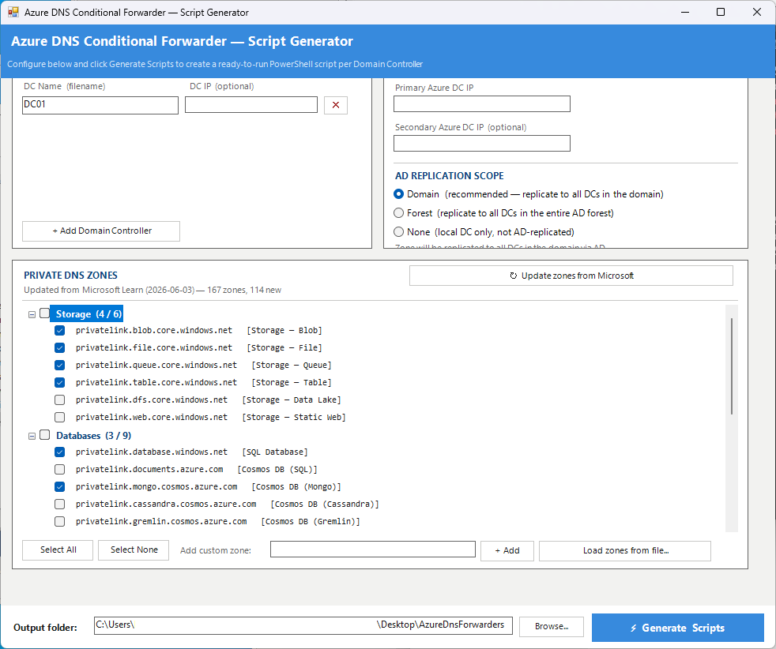

# Azure DNS Conditional Forwarder — Script Generator

A standalone PowerShell GUI tool that generates per-DC PowerShell scripts to configure **Azure Private DNS conditional forwarders** on your on-premises Active Directory Domain Controllers.

The generator runs fully offline. An optional **Update zones from Microsoft** button fetches the latest Private Link DNS zone list directly from Microsoft Learn when internet access is available. The generated scripts are fully self-contained and run directly on the target DC.



---

## What it does

For each Domain Controller you enter, the tool generates a ready-to-run `.ps1` script that:

- Creates or updates **DNS conditional forwarder zones** pointing to your Azure DNS resolvers
- Checks port 53 reachability to the Azure DCs before applying
- Supports **AD-integrated replication** (Domain, Forest, or local-only)
- Prints a colour-coded summary of created / updated / failed zones
- Exits with code `0` (success) or `1` (any zone failed) — CI/CD friendly

---

## Requirements

| Requirement | Details |
|---|---|
| **Run the generator on** | Any Windows machine with PowerShell 5.1+ |
| **Run the generated script on** | Windows Server with the `DnsServer` RSAT module |
| **Permissions for generated script** | Domain Administrator, run as Administrator |
| **Network** | Port 53 reachable from each DC to the Azure DNS resolver IPs |

---

## How to run

Right-click `AzureDnsForwarderGenerator.ps1` → **Run with PowerShell**, or from a terminal:

```powershell
powershell -ExecutionPolicy Bypass -File .\AzureDnsForwarderGenerator.ps1
```

---

## Using the tool

### 1 — Domain Controllers

Add one row per on-premises DC.

| Field | Description |
|---|---|
| **DC Name** | Used as the output filename — e.g. `DC01` → `Apply-AzureDnsForwarders_DC01.ps1` |
| **DC IP** | Optional. Shown as a comment inside the generated script for reference |

Click **+ Add Domain Controller** to add more rows. Click **✕** to remove a row.

### 2 — Azure DC Forwarder IPs

Enter the IP address(es) of your Azure DNS resolvers (typically the Azure-side DCs or Azure DNS Private Resolver inbound endpoints).

| Field | Description |
|---|---|
| **Primary Azure DC IP** | Required. All forwarded queries go here first |
| **Secondary Azure DC IP** | Optional. Adds a fallback forwarder |

### 3 — AD Replication Scope

Controls how the conditional forwarder zone is replicated across your AD infrastructure.

| Scope | Description |
|---|---|
| **Domain** *(recommended)* | Replicates to all DCs in the domain via AD |
| **Forest** | Replicates to all DCs in the entire AD forest |
| **None** | Local DC only — not AD-replicated |

### 4 — Private DNS Zones

Zones are loaded from `AzureDnsForwarders.zones.json` (included). They are grouped into collapsible categories:

| Category | Services |
|---|---|
| Storage | Blob, File, Queue, Table, Data Lake, Static Web |
| Databases | SQL, Cosmos DB (all APIs), MySQL, PostgreSQL, MariaDB |
| Security | Key Vault, Key Vault HSM |
| App Services & Containers | App Service, Container Registry, Static Web Apps, Container Apps |
| Integration | Service Bus / Event Hubs, Event Grid |
| Management & Monitoring | Automation, Monitor, Log Analytics |
| AI & Cognitive | Cognitive Services, Azure OpenAI, Cognitive Search |
| Data & Analytics | Redis, Synapse, Data Factory, Purview |
| IoT & Digital Twins | IoT Hub, IoT DPS, Digital Twins |
| ML & HDInsight | ML Workspace, ML Notebooks, HDInsight |
| Other | Media, App Configuration, SignalR, Web PubSub, Healthcare, Backup, Site Recovery |

**Category header** — click the checkbox to select/deselect all zones in that group at once. Click the arrow to expand or collapse.

**Toolbar actions:**

| Button | Action |
|---|---|
| Select All | Check every zone across all categories |
| Select None | Uncheck every zone across all categories |
| + Add | Add a custom zone name (appended under a *Custom* category) |
| Load zones from file... | Load a different `*.json` zones file at runtime |
| ↻ Update zones from Microsoft | Download the latest zone list from Microsoft Learn and merge it into the current list |

#### Updating zones from Microsoft Learn

The **↻ Update zones from Microsoft** button in the top-right of the Private DNS Zones panel fetches the official Azure Private Endpoint DNS zone list directly from Microsoft and merges any newly published zones into `AzureDnsForwarders.zones.json`.

How it works:

1. Downloads the raw documentation from the [MicrosoftDocs GitHub repository](https://raw.githubusercontent.com/MicrosoftDocs/azure-docs/main/articles/private-link/private-endpoint-dns.md)
2. If GitHub is unreachable, falls back to scraping the rendered [Microsoft Learn page](https://learn.microsoft.com/en-us/azure/private-link/private-endpoint-dns)
3. Parses the **Commercial** cloud section and extracts all static `privatelink.*` zone names (region-parameterised zones such as `privatelink.{regionName}.azmk8s.io` are skipped automatically)
4. **Merges** new zones into the existing list — zones already present are left untouched, including any enabled/disabled state the user has set
5. New zones are added **unchecked by default** so nothing is forwarded unintentionally
6. Saves the updated `AzureDnsForwarders.zones.json` and immediately refreshes the zone list in the UI

> **Note:** The update button requires outbound internet access (HTTPS on port 443) to `raw.githubusercontent.com` or `learn.microsoft.com`. The rest of the tool works fully offline.

### 5 — Output folder

Choose where the generated scripts are saved. Defaults to `Desktop\AzureDnsForwarders`. The folder is created automatically if it does not exist.

### 6 — Generate Scripts

Click **⚡ Generate Scripts**. One `.ps1` file is created per DC. When done, you are offered to open the output folder directly.

---

## Customising the default zone list

Edit `AzureDnsForwarders.zones.json` next to the script. The format is:

```json
{
  "zones": [
    { "name": "privatelink.blob.core.windows.net", "label": "Storage — Blob", "enabled": true  },
    { "name": "privatelink.vaultcore.azure.net",   "label": "Key Vault",       "enabled": false }
  ]
}
```

| Field | Description |
|---|---|
| `name` | The DNS zone name to forward |
| `label` | Friendly label shown in the UI (supports any text) |
| `enabled` | `true` = pre-checked when the tool opens, `false` = unchecked |

The file ships with 52 zones covering all major Azure Private Link services. The 10 most commonly used zones are pre-checked; the rest are available but unchecked by default.

You can also load a completely different zones file at runtime using the **Load zones from file...** button without editing the default file.

---

## Running the generated script

Copy the generated `Apply-AzureDnsForwarders_<DCName>.ps1` to the target DC and run it as Domain Administrator:

```powershell
# On the target Domain Controller — run as Administrator
powershell -ExecutionPolicy Bypass -File .\Apply-AzureDnsForwarders_DC01.ps1
```

The script will:

1. Print a banner with the target DC, forwarder IPs, scope and zone count
2. Test TCP port 53 connectivity to each Azure DC IP
3. Create or update each selected zone
4. Print a summary table of all existing conditional forwarder zones
5. Exit with code `0` (all OK) or `1` (one or more zones failed)

---

## File overview

| File | Description |
|---|---|
| `AzureDnsForwarderGenerator.ps1` | The GUI tool — run this |
| `AzureDnsForwarders.zones.json` | Default zone list — edit to customise defaults |
| `privatednszones.txt` | Legacy plain-text zone list (not used by the tool) |

---

## Notes

- The generator runs **fully offline** — the Update button is the only feature that requires internet access
- Generated scripts are standalone — no external files needed on the DC
- The `.ps1` and `.zones.json` files are saved as **UTF-8 with BOM** so PowerShell 5.1 handles special characters correctly
- Tested on Windows Server 2019 / 2022 with PowerShell 5.1

---

*Generated scripts reference: [Azure Private Endpoint DNS integration](https://learn.microsoft.com/azure/private-link/private-endpoint-dns-integration)*
